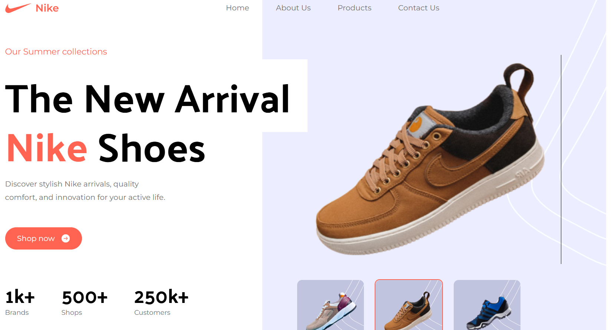
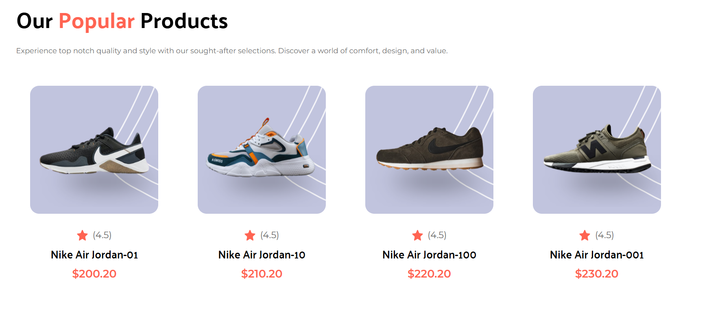
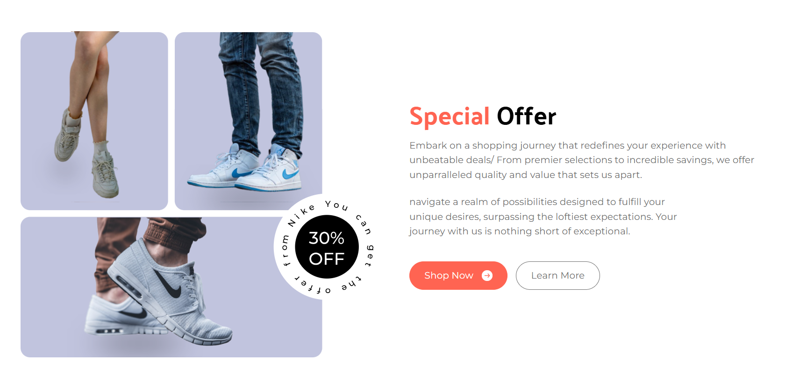
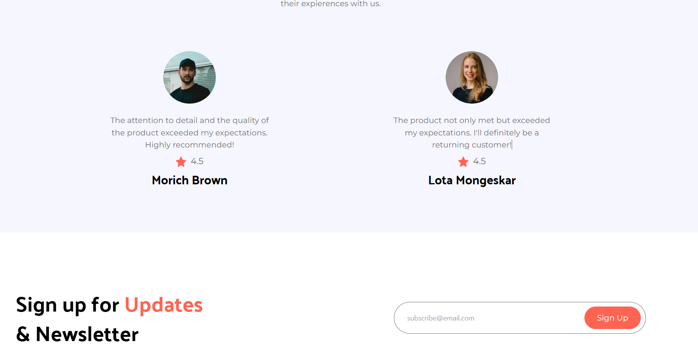

# Nike Sport Website - Frontend Project

## Description
This project is a fully responsive and professional-looking Nike Sport website built using React and styled with Tailwind CSS. The website replicates the design standards of modern, real-world e-commerce platforms, providing an intuitive and visually appealing user experience across all devices.

## Features
- **Responsive Design**: Fully optimized for mobile, tablet, and desktop devices.
- **Modern UI/UX**: Implements a sleek and professional interface, maintaining consistency with Nike's branding style.
- **Reusable Components**: Built using React components for modularity and scalability.
- **Tailwind CSS**: Styled entirely with Tailwind CSS for rapid development and precise control over styling.

## Technologies Used
- **React**: JavaScript library for building user interfaces.
- **Tailwind CSS**: Utility-first CSS framework for styling.
- **Vite**: Build tool for fast development and optimized builds.

## Folder Structure
```
├── src
│   ├── components  # Reusable React components
│   ├── assets      # Images and other static assets
│   ├── constants   # Constants file that centralizes and organizes static data
│   └── App.jsx     # Main application file
├── public          # Static files
├── package.json    # Project metadata and dependencies
├── tailwind.config.js # Tailwind CSS configuration
└── vite.config.js  # Vite build tool configuration
```

## Key Highlights
- **Responsiveness**: Tailwind's responsive utilities ensure the website looks great on all screen sizes.
- **Performance**: Optimized assets and Vite's fast build system ensure smooth performance.
- **Scalability**: Reusable components and modular architecture allow for easy future expansion.

## Screenshots





## Future Improvements
- Integration with a backend for dynamic product data.
- Adding user authentication and cart functionality.
- Enhancing animations and transitions for a more engaging user experience.
